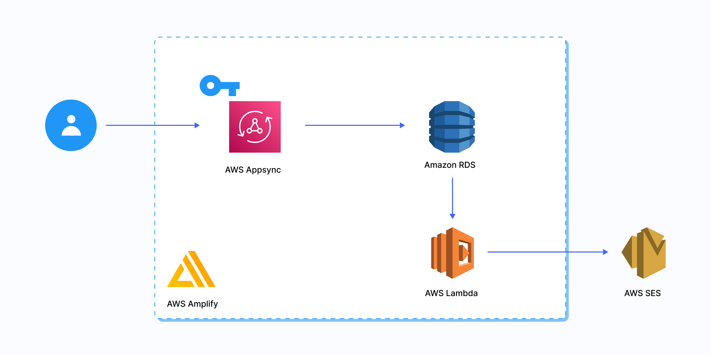

# AWS SES Notification With AWS Amplify Workshop

This project is about how to set up a full-stack serverless ReactJS application using AWS Amplify with AWS SES to send notification.

Full details can be found in Blog Posts Referance.

## Blog Posts Reference

| Blog Post  
| -----------------
| [How To Send Transactional Emails Using Lambda and Amazon SES](https://www.prplbx.com/resources/blog/transactional-emails-using-lambda-and-amazon-ses)

## Tech Stack

### Front End Development 💻

 

### Back End Development 📚

  

### Serverless & Cloud Development 🚀

   

### CI/CD & Hosting & Tools 📂

   

## Run Locally

Clone the project

```bash
  git clone https://github.com/PBCLOUD/SES-notification-workshop.git
```

Go to the project directory

```bash
  cd SES-notification-workshop
```

Install dependencies

```bash
  npm install
  npm install -g @aws-amplify/cli
```

Initialize AWS Environment

```bash
  amplify init
```

Follow instructions on blog post

| [How To Send Transactional Emails Using Lambda and Amazon SES](https://www.prplbx.com/resources/blog/transactional-emails-using-lambda-and-amazon-ses)

Start the server

```bash
  npm run dev
```

## Feedback

If you have any feedback, please reach out to us at kaan@prplbx.com
